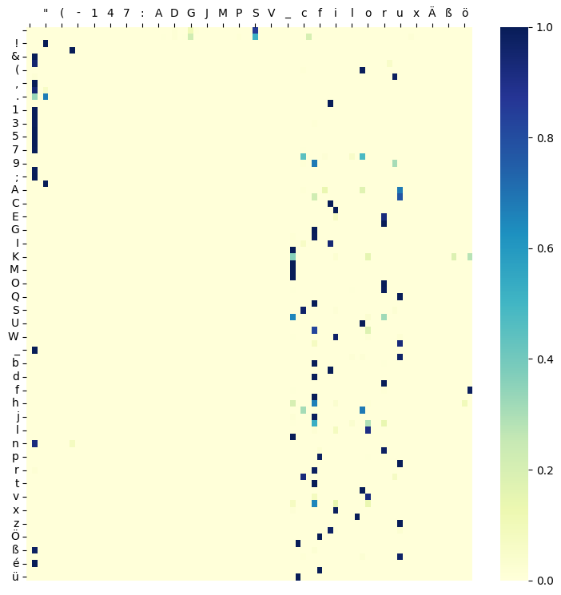
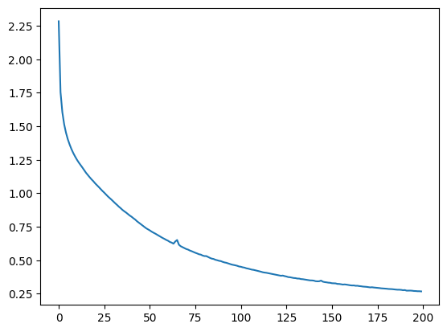

# Tiny Mann
Character-level Recurrent Neural Network (RNN) trained on Heinrich Mann's novel "Der Untertan" (1918) to generate new text on character-by-character basis (work in progress). 

Heinrich Mann's opus magnum, "Der Untertan" is considered one of the classics of German literature. The model applied is a stateful RNN with one embedding layer and three LSTM-layers. It is trained on the complete novel (847,692 characters), obtained from [Projekt Gutenberg](https://www.projekt-gutenberg.org/mannh/untertan/untertan.html). The novel is divided into sequences of 200 characters which are fed to the RNN in order to predict the next character in the sequence. Here are the opening lines of Mann's novel: 

> Diederich Heßling war ein weiches Kind, das am liebsten träumte, sich vor allem fürchtete und viel an den Ohren litt. Ungern verließ er im Winter die warme Stube, im Sommer den engen Garten, der nach den Lumpen der Papierfabrik roch und über dessen Goldregen- und Fliederbäumen das hölzerne Fachwerk der alten Häuser stand.

In the process of training, the model learns to mimick Mann's incomparable style. While the untrained model returns random noise essentially: 

> Art des Güngesertänter j zist, eitte dFÄst tetlänxen wllsoc konnt. Suchs, bist gwür grhote. Ur verbst

After as few as 200 training iterations (or "epochs"), the output becomes appreciably more legible: 

> Aufgebracht waren die Schwestern Rollen Aufbruch mit Buck als einen solten, zeigten sie sich aus, und 

While still nonsensical, at this point the model already produces meaningful words and starts to combine them into coherent part-sentences ("Aufgebracht waren die Schwestern"). The following figure shows for each character (rows) which letters the model considers to be most likely follow-up, where darker colors indicate higher estimated probability. At 200 epochs, these mappings become quite specific already.

A couple of observations: 

1. Even without further improvements to the model architecture, the loss curve betrays the potential for the predictions to become even better. Allowing the model to train for longer, as well as making it more sophisticated, are avenues to further extend this project. 

1. The fact that the model is trained on prose makes it comparatively easy to spot mistakes and get a feeling for model performance.

1. Overall the model is trained on a relatively small dataset (800k characters). By extending the data for training, the model is likely to improve performance. 

Inspired by Andrej Karpathy's [Tiny Shakespeare](https://github.com/karpathy/char-rnn) project and building on code in [this repo](https://github.com/spro/practical-pytorch/blob/master/char-rnn-generation/char-rnn-generation.ipynb). 

Tags: Deep Learning, RNN, Embeddings, LSTM, Pytorch, NLP. 
